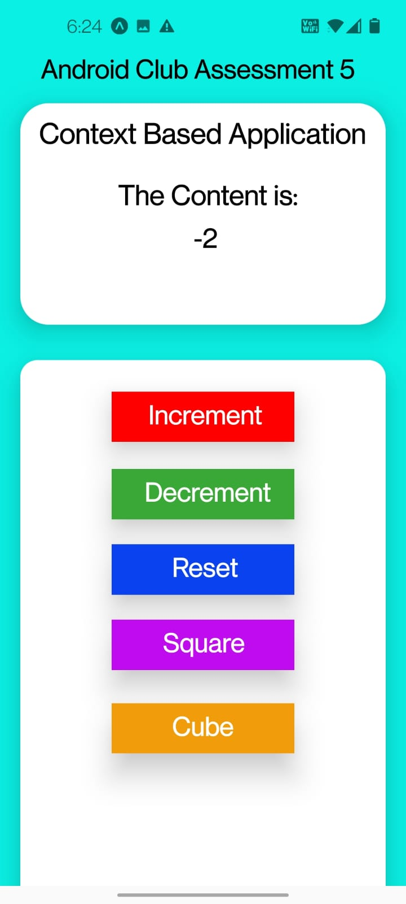
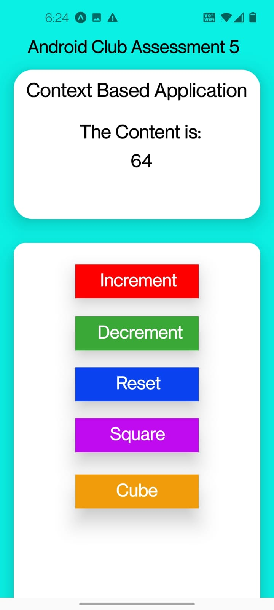

# Android Club Assessment 5

App using userContext

Submmitted by:

Name: Rochak Shrivastav

Reg. No.: 20BCE1814

This app will modify the content as to increment the content to 1 by clicking 1, decrement by 1 by clicking decrement, reset to 0 by clicking on reset, Squaring the value of content by clicking square and print cube of the content by clicking cube

The Screenshots are:
- Increment:

  

- Decrement:

  

- Reset:

  

- Square:

  

- Cube:

  
